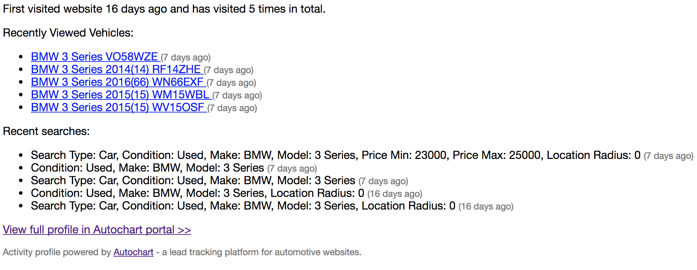

# Embedding Autochart data into enquiry email templates
This article will show you how to fetch data from Autochart's API in order to embed in an email template.
It is aimed at web developers who would be implementing this feature.

## Prerequisites
- Autochart tracking has been implemented on your website
- The server-side website code which populates data into the email template can be customised
- Your web server can make network calls out to the internet over port 443 (HTTPS)
- You have the `Account ID/Tracking Key` and `Read Key` for your website's Autochart account (available by logging in to the Autochart portal)

## What does it look like?
The screenshot below gives an example of the information which will be retrieved from Autochart to include in the email:



## Implementation Overview
The sequence of steps below shows how the embedding of the Autochart data into emails is typically implemented. Technology-specific code examples are provided at the end of this article. Steps marked as __[New]__ are those which developers will need to add code for.

1. Visitor fills out website enquiry form and clicks Submit/Send button
2. Server-side code takes all the contents of the form fields and substitutes them into your email template, formatting them appropriately
3. __[New]__ Server-side code gets the unique VisitorID assigned by the Autochart tracking API from the `ac_visitor` cookie
4. __[New]__ Using this VisitorID, server-side code makes call to Autochart HTTP API to get full profile data for this visitor (as a JSON object)
5. __[New]__ Server-side code extracts relevant data (latest vehicle views, search criteria used, etc) from the JSON object, formats it appropriately and populates it into a placeholder in the email template
6. Server-side code sends the email to the sales team

## API: Get Visitor Summary
This API call (over HTTPS) fetches summary data related to a visitor's activity on the website which can then be embedded into an email.
#### Authentication
The `Read Key` must be passed in as a bearer token in the `Authorization` HTTP header to all requests to the API.

#### Request
To fetch the data, make the following HTTP request, substituting values for `:account_id` and `:visitor_id`:
```
GET https://portal.autochart.io/api/1/accounts/:account_id/visitors/:visitor_id/text-summary
```
The `visitor_id` can be identified by inspecting the cookie (see below). The `:account_id` field should be stored as a configuration setting within your website. We can provide you with this setting if you don't have access to the Autochart portal.

#### Response
A valid response will have a status code of `200` and the response body will be a HTML snippet (not a full HTML page) which can be embedded directly into an email. All other HTTP response codes should be treated as an error (e.g. `404` if visitor ID wasn't found).
Here is an example response:

```html
<div class="autochart-profile">
    <p class="history">
        First visited website 5 days ago
        and has visited 14 times in total.
    </p>
    <p>
       Recently Viewed Vehicles:
       <ul class="vehicle-views">
            <li>
                <a href="http://www.exampledealersite.com/bmw/used-cars/7757866-bmw-3-series-320i-x-drive-m-sport-saloon/">
                    BMW 3 Series 2013(13) YA13KVF
                </a>
                <span class="timestamp" style="font-size:small; color: #777777">(2 days ago)</span>
            </li>
            <li>
                <a href="http://www.exampledealersite.com/bmw/used-cars/7757866-bmw-3-series-320i-x-drive-m-sport-saloon/#location-details">
                BMW 3 Series 2013(13) YA13KVF
                </a>
                <span class="timestamp" style="font-size:small; color: #777777">(2 days ago)</span>
            </li>
            <li>
                <a href="http://www.exampledealersite.com/bmw/used-cars/7757866-bmw-3-series-320i-x-drive-m-sport-saloon/#tab-images-content">
                BMW 3 Series 2013(13) YA13KVF
                </a> <span class="timestamp" style="font-size:small; color: #777777">(4 days ago)</span>
            </li>
        </ul>
    </p>
    <p>
       Recent searches:
       <ul class="searches">
            <li>
                Search Type: Car, Condition: Used, Make: BMW, Model: 3 Series
                <span class="timestamp" style="font-size:small; color: #777777">(17 hours ago)</span>
            </li>
            <li>
                Search Type: Car, Condition: Used, Make: BMW, Model: 3 Series
                <span class="timestamp" style="font-size:small; color: #777777">(2 days ago)</span>
            </li>
        </ul>ß
    </p>
    <p>
        <a class="profile-link" href="https://portal.autochart.io/a/592d4b76b1268d0010c1206b/leads/58cd3ce65242b75baf000001">
            View full profile in Autochart portal &gt;&gt;
        </a>
    </p>
</div>
```
Note that the content will always be surrounded by a `<div class="autochart-profile">` element.

<!-- #### Advanced
If you wish to receive the full raw data object for the visitor rather than simply a HTML-formatted summary, you can use the
`GET https://portal.autochart.io/api/1/accounts/:account_id/visitors/:visitor_id/summary` endpoint which returns a detailed JSON object with
full details on the visitor data -->

### Reading VisitorID from cookie
The visitorID is a 24 character long string which uniquely identifies this visitor to Autochart. It is stored in a cookie called `ac_visitor`. The cookie value is a stringified JSON object with a single property `id`, so you will need to parse the JSON and extract the `id` field (see sample PHP code below).

## Best Practices
### Provide Contextual Information
We recommend adding the Autochart snippet towards the end of your email template and include a section heading describing what the data represents.
e.g.
> __Visitor Activity Summary__
>
> ... embedded content here ...

### Design for failure
The Autochart API, like any third-party integration, should be treated as a system which may occasionaly fail, either due to transient network issues or server downtime. As a website developer, you must ensure that your website is robust and always sends the enquiry email to its recipient regardless of whether you get a valid response from the Autochart API. As the Autochart data is supplementary to the main contents of a new lead enquiry email, you could just include a message such as "Autochart data not available at this time" in cases of failure.

How you implement this depends on the server-side technology you are using but most modern languages provide a try/catch mechanism which we would recommend you use.

### Implement an On/Off switch
By providing a mechanism to turn Autochart data embedding on or off at a website level, it makes it easier to test and roll out this feature.
For example, if you are a website provider serving several dealer clients, this also allows you to quickly enable the feature for new clients or disable the feature again if the client cancels their Autochart subscription, all without needing to add or remove lines of code.
This can be implemented by adding a simple configuration setting (e.g. `EmbedAutochartDataInEnquiries`) to your website config file or database and only running your integration code if this setting is enabled.

## Code Examples
### PHP

```php
function GetAutochartVisitorSummary($accountId, $apiReadKey)
{
    // Get visitorId from JSON within cookie
    $acVisitorCookie = $_COOKIE['ac_visitor'];
    if (isset($acVisitorCookie)) {
        $visitorId = json_decode(urldecode($acVisitorCookie))->id;
        // Uses curl library to make a HTTP call to the Autochart API
        $curl = curl_init();
        $url = "https://portal.autochart.io/api/1/accounts/{$accountId}/visitors/{$visitorId}/text-summary";
        curl_setopt($curl, CURLOPT_URL, $url);
        curl_setopt($curl, CURLOPT_HTTPHEADER, array("Authorization: Bearer {$apiReadKey}"));
        // Wait for maximum of 10 seconds
        curl_setopt($curl, CURLOPT_CONNECTTIMEOUT, 10);
        curl_setopt($curl, CURLOPT_TIMEOUT, 10);
        curl_setopt($curl, CURLOPT_RETURNTRANSFER, 1);
        $result = curl_exec($curl);
        $http_status = curl_getinfo($curl, CURLINFO_HTTP_CODE);
        if ($http_status !== 200) {
            return false;
        }
        curl_close($curl);
        return $result;
    }
    return false;
}

$autochartAccountId = '512345678901234567890123';  // TODO: read from config setting
$autochartApiReadKey = 'rk_a123456789abcdef0123456789abcdef'; // TODO: read from config setting
$autochartVisitorSummary = GetAutochartVisitorSummary($autochartAccountId, $autochartApiReadKey);

if ($autochartVisitorSummary === false) {
    $autochartVisitorSummary = 'Unable to fetch visitor profile data at this time';
}
// ... you can now substitute the contents of the $autochartVisitorSummary string into your email template

```

### ASP.NET
There is a dedicated .NET client SDK for Autochart [here](https://github.com/WinterWindSoftware/autochart-dotnet) which acts as a wrapper to the HTTP API.
However, this SDK currently doesn't support the `text-summary` API call.

## Need more help?
If you have encounter issues or constraints which make implementing any of the above difficult, we are more than happy to help. Just send an email to support@autochart.io and we will get back to you promptly. We are happy to work directly with your developers to get to the right solution.
